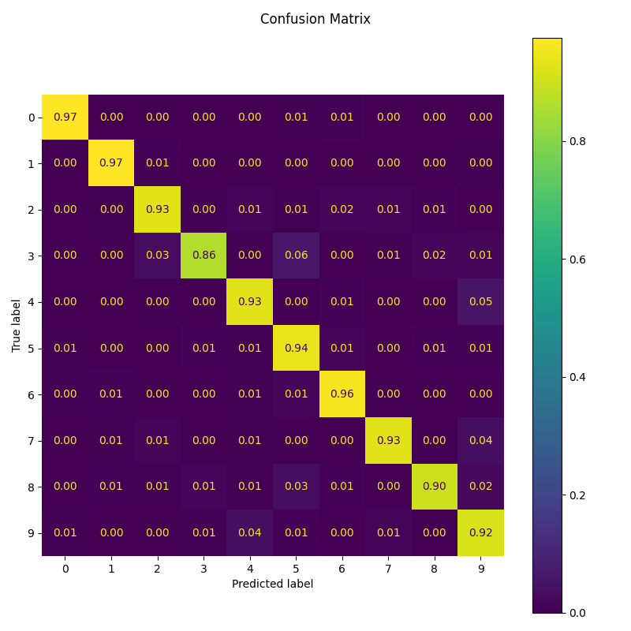
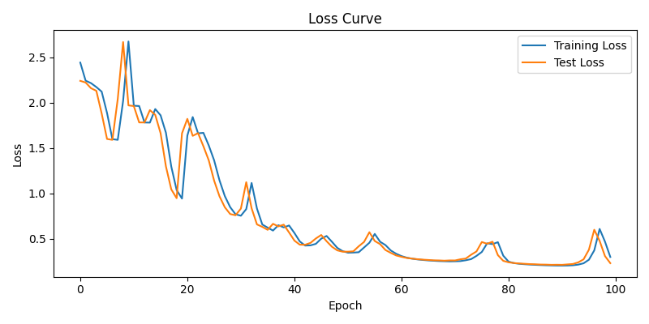
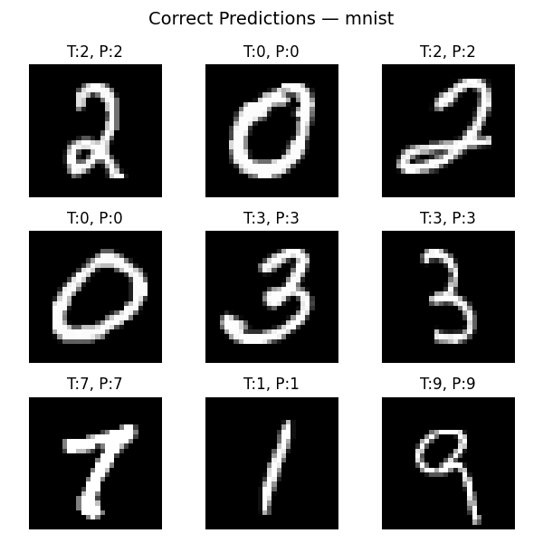
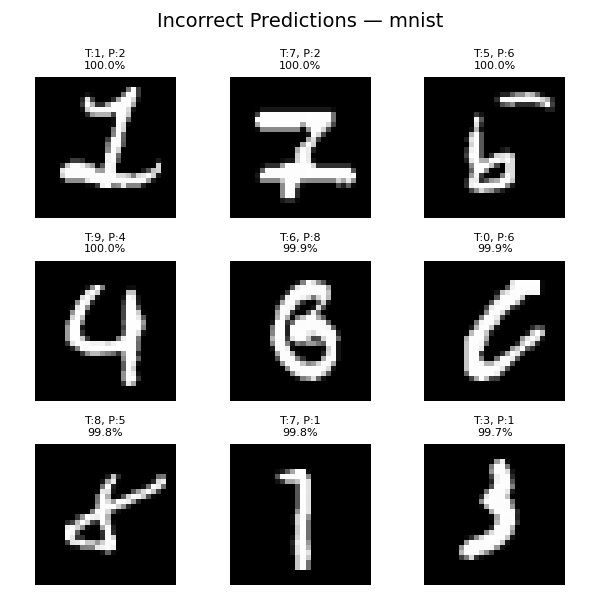
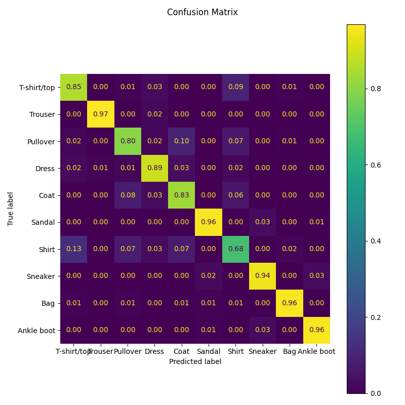
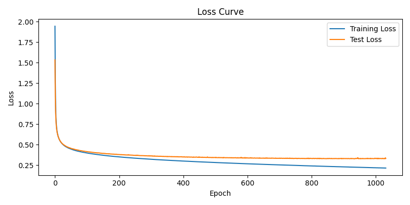
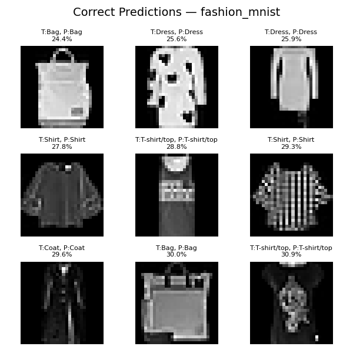
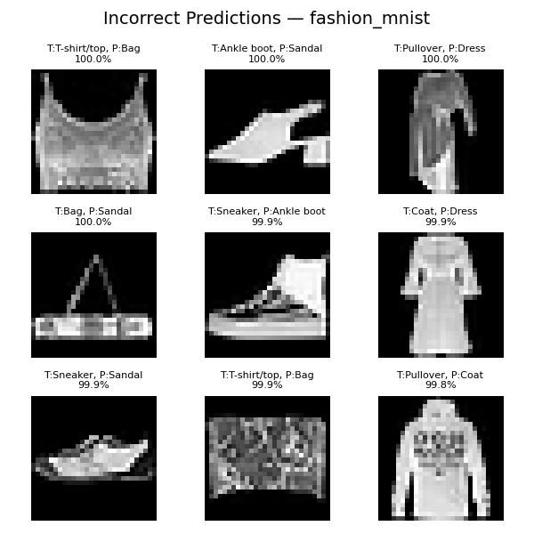

# Multilayer Perceptron (MLP)

## Overview

This project is an implementation of a Multilayer Perceptron (MLP), a type of feedforward neural network, from scratch only using NumPy.

An MLP consists of layers of interconnected nodes (neurons), where each layer performs a linear transformation, followed by a non-linear activation function.

The goal of this project is to **build and train MLPs without using any deep learning libraries** (TensorFlow, PyTorch), to understand the internals of neural networks.

## Getting Started

Follow these steps to set up the project on your local machine:

### 1. Clone the Repo

```bash
git clone https://github.com/augustinmuyl/mlp.git
cd mlp
```

### 2. Setup Python

```bash
python3 -m venv .venv  # create venv
source .venv/bin/activate  # activate venv
pip install -r requirements.txt  # install dependencies
```

## Usage

To launch the interactive CLI:

```bash
python cli.py
```

You can train a model using your preferred parameters for the following:

- The number of hidden layers and neurons per layer
- The learning rate
- Either:
  - A fixed number of epochs, or
  - Enable **dynamic epoch stopping** using a "patience" value, which stops training early when the model stops improving 

After training, the CLI will automatically save model and training info to `data/last_run/`

You can then access the following plots:

- Training loss vs Test loss
- Predicted points
- Decision boundary

> Note: all plots have both terminal and GUI versions

## Features

- Train MLPs from scratch using NumPy
- Interactive CLI to configure training
- Terminal and GUI plots:
  - Loss curves
  - Predictions
  - Decision boundary
- Dynamic epoch stopping with configurable patience

## 📊 Results

### MNIST

- Best Accuracy: 98.01%
- Confusion Matrix:
  
- Loss Curve:
  
- Correct Examples:
  
- Incorrect Examples:
  

### Fashion-MNIST

- Best Accuracy: 87.65%
- Confusion Matrix:
  
- Loss Curve:
  
- Correct Examples:
  
- Incorrect Examples:
  

## 🛠️ Remaining Tasks (Roadmap)

### 📦 Multi-Dataset Support

- [ ] Add dataset selector to CLI:
  - [ ] `make_moons` (2-class)
  - [ ] `make_classifications` (2-class)
- [x] Refactor dataset loading + training logic (e.g. separate function per dataset)

---

### 🧪 Fashion-MNIST Evaluation

- [x] Add Fashion-MNIST dataset (`fetch_openml("Fashion-MNIST", ...)`)
- [x] Train NumPy MLP on Fashion-MNIST
- [x] Save + display:
  - [x] Accuracy
  - [x] Loss curves
  - [x] Confusion matrix

---

### 🔄 PyTorch Comparison

- [ ] Rename `test.py` → `compare_pytorch.py`
- [ ] Show NumPy vs PyTorch results (accuracy, loss)
- [ ] Optional: compare training time
- [ ] Summarize in a table in the README

---

### 📉 Plot Exporting

- [x] Save `loss.png` during training
- [x] Save `confusion_matrix.png` after evaluation
- [x] Store all plots under `media/` or `outputs/`

---

### 💾 Model Saving and Loading

- [ ] Add CLI menu option: save model
- [ ] Add CLI menu option: load and evaluate model
- [ ] Hook into `model.save()` and `model.load()`

---

### 🔍 Grid Search (Optional)

- [ ] Create `grid_search.py`
- [ ] Run combinations of hidden layers and learning rates
- [ ] Save best config and scores
- [ ] (Optional) Include results in README

---

### 📄 README Improvements

- [ ] Add **Performance** section with table:
  - [ ] make_moons, MNIST, Fashion-MNIST
  - [ ] NumPy vs PyTorch accuracy
- [ ] Add screenshots or plot images
- [ ] Document CLI features: dataset selection, saving/loading, plots
- [ ] Highlight educational vs practical tradeoffs

---

### 🌐 Portfolio Integration

- [ ] Create CLI demo `.gif` (e.g. using `asciinema`)
- [ ] Add LinkedIn/GitHub description (1–2 line summary)
- [ ] Add tags and project topics to GitHub
